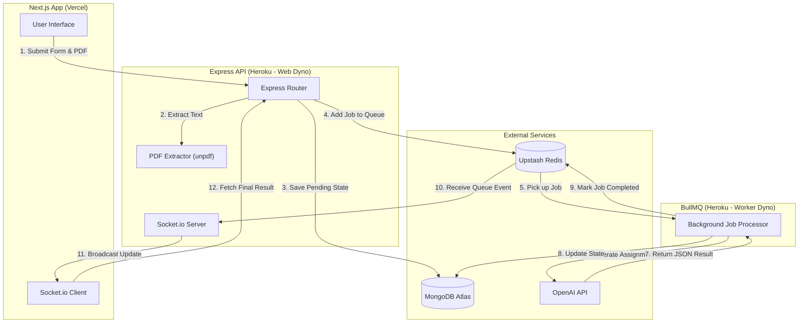

# Veda AI

Veda AI is an intelligent, AI-powered platform for educators and students to instantly generate customized assignments, question papers, and study materials. By specifying the subject, grade, question types, and optionally uploading PDF context, Veda AI produces high-quality structured assessments.

## Key Features

- **Custom Assignment Generation:** Tailor assignments by subject, grade, time allowed, and precise breakdown of question types and marks.
- **Context-Aware AI:** Provide additional text or upload PDF documents for the AI to base the assignment on.
- **Asynchronous Processing:** Long-running AI tasks are managed safely in the background via BullMQ.
- **Real-Time UI Updates:** Socket.io provides live feedback when your assignment begins processing and finishes.
- **PDF Export:** Seamlessly download the generated question paper as a formatted PDF.

## Tech Stack

- **Frontend:** Next.js 16 (App Router), React 19, Tailwind CSS v4, Zustand, shadcn/ui
- **Backend:** Node.js 20, Express 5, TypeScript
- **Database & Cache:** MongoDB (Mongoose), Redis (Upstash)
- **Background Jobs:** BullMQ
- **Real-time Communication:** Socket.io
- **AI Integration:** OpenAI API (gpt-4o) via Vercel AI SDK
- **Deployment:** Vercel (Frontend), Heroku (Backend - Web & Worker Dynos)

## Our Approach

Building Veda AI required combining several modern technologies to handle heavy computational tasks without blocking the user interface. Here is how we approached the key challenges:

1. **Handling Long-Running AI Requests:**
   Generating complex assignments with OpenAI takes time. Instead of keeping the HTTP request open and risking timeouts, we adopted an **asynchronous event-driven pattern**. When a user submits a form, the backend immediately responds with an assignment ID while queuing a background job via **BullMQ**.
2. **Context-Aware Generation:**
   To allow users to base their assignments on existing materials, we integrated the `unpdf` library. When a user uploads a PDF, the backend extracts the text and injects it directly into the system prompt built for the AI, giving the model precise context for the generated questions.
3. **Real-Time Feedback:**
   Since the generation happens in the background, the UI needs a way to know when it's done. We implemented **Socket.io** to establish a persistent WebSocket connection between the frontend and backend. As soon as the BullMQ worker completes the job, it signals the Express server via a Redis `QueueEvents` listener, which immediately broadcasts a completion event to the connected client.
4. **Resilient Production Deployment:**
   The application is separated into a frontend deployed on **Vercel** and a backend deployed on **Heroku**. The backend is further split into two distinct processes: a `web` dyno handling HTTP/WebSocket traffic and a `worker` dyno dedicated to processing AI jobs. This separation of concerns ensures that heavy AI processing does not degrade the performance of the web server.

## Architecture

### System Flow Diagram



### Directory Structure

```text
├── frontend/             # Next.js web application
│   ├── app/              # App router pages (dashboard, assignments)
│   ├── components/       # Reusable React components (shadcn UI, custom forms)
│   ├── hooks/            # Custom React hooks (useSocket)
│   ├── lib/              # Frontend utilities and Zustand store
│   └── public/           # Static assets (SVGs, images)
├── backend/              # Express Node.js API
│   ├── src/
│   │   ├── config/       # Environment configuration
│   │   ├── lib/          # Utilities (prompt builder, Redis queue config)
│   │   ├── models/       # Mongoose models (Assignment)
│   │   ├── routes/       # Express API routes (/assignments, /upload)
│   │   ├── workers/      # BullMQ worker processes
│   │   └── index.ts      # Express server & Socket.io entry point
│   ├── Procfile          # Heroku deployment configuration
│   └── package.json
```

### Request Lifecycle

1. **User Submission:** The user fills out the assignment form in the Next.js frontend, optionally uploading a PDF document.
2. **File Processing:** If a PDF is uploaded, it is sent to the backend `/api/upload` endpoint, where `unpdf` extracts the text context.
3. **Job Queuing:** The frontend submits the assignment parameters to `/api/assignments`. The backend saves a "pending" record in MongoDB and adds an `AssignmentJobData` payload to the BullMQ Redis queue.
4. **Background Processing:** The separate `worker` dyno picks up the job from Redis, constructs a complex prompt using the `promptBuilder`, and streams a response from the OpenAI API.
5. **Real-time Notification:** Once the worker completes the AI generation, the `web` dyno receives a `QueueEvents` "completed" signal via Redis and broadcasts a Socket.io event (`assignment:completed`) to the client.
6. **UI Update:** The React frontend receives the WebSocket event, refetches the final generated assignment, and renders the result, allowing the user to export it.

## Prerequisites

Before running Veda AI locally, ensure you have the following installed:

- **Node.js** (v20+ recommended)
- **npm** or **yarn**
- **MongoDB Database** (Local instance or MongoDB Atlas)
- **Redis Database** (Local instance or Upstash)
- **OpenAI API Key**

## Getting Started

### 1. Clone the Repository

```bash
git clone https://github.com/meetbatra/vedaai.git
cd vedaai
```

### 2. Backend Setup

Open a terminal and navigate to the backend directory:

```bash
cd backend
npm install
```

Copy the environment variables template and configure it (create `.env` if it doesn't exist):

```bash
cp .env.example .env
```

**Backend `.env` Configuration:**
| Variable | Description |
| --- | --- |
| `PORT` | API server port (default `8080`) |
| `MONGODB_URI` | MongoDB connection string |
| `BULLMQ_REDIS_URL` | Redis connection string (for BullMQ) |
| `OPENAI_API_KEY` | Your OpenAI API key |
| `FRONTEND_URL` | Used for CORS (e.g., `http://localhost:3000`) |

Start the backend environment:

```bash
# Terminal 1: Run the Express API server
npm run dev

# Terminal 2: Run the BullMQ background worker
npm run worker
```

### 3. Frontend Setup

Open a new terminal and navigate to the frontend directory:

```bash
cd frontend
npm install
```

Set up the environment variables:

```bash
cp .env.local.example .env.local
```

**Frontend `.env.local` Configuration:**
| Variable | Description | Default |
| --- | --- | --- |
| `NEXT_PUBLIC_BACKEND_URL` | URL of the backend API | `http://localhost:8080` |
| `NEXT_PUBLIC_SOCKET_URL` | URL of the Socket.io server | `http://localhost:8080` |

Start the Next.js development server:

```bash
npm run dev
```

Open [http://localhost:3000](http://localhost:3000) in your browser.

## Deployment

### Vercel (Frontend)

1. Connect your GitHub repository to Vercel.
2. Set the Root Directory to `frontend`.
3. Add the `NEXT_PUBLIC_BACKEND_URL` and `NEXT_PUBLIC_SOCKET_URL` environment variables pointing to your Heroku backend.
4. Deploy. Vercel will automatically build the Next.js app.

### Heroku (Backend)

The backend requires two dynos: one for the web server and one for the worker.

1. Create a new Heroku application.
2. Add the **Heroku Redis** or Upstash Redis add-on, and add your MongoDB connection string to the Config Vars.
3. Add the `OPENAI_API_KEY` and set `NODE_ENV=production`.
4. Deploy via GitHub integration or Heroku CLI:

```bash
# Using Git Subtree to deploy only the backend directory
git push heroku `git subtree split --prefix backend main`:main --force
```

5. Scale your dynos using the provided `Procfile`:

```bash
heroku ps:scale web=1 worker=1
```
